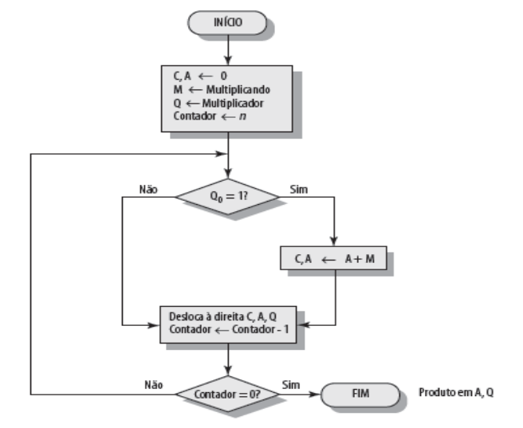
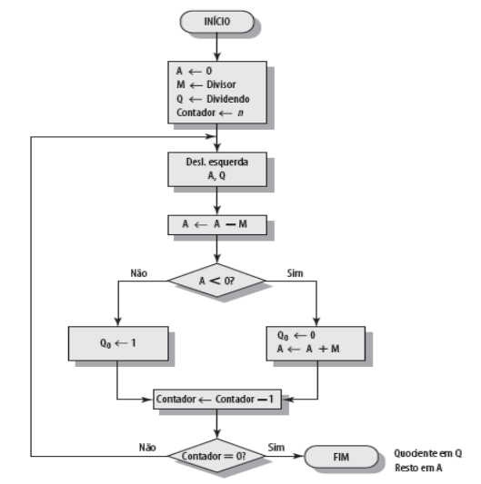

# multiplicador-divisor

Implementação dos algoritmos de multiplicação e divisão na linguagem C.

## Multiplicação

O algoritmo de Multiplicação:

```bash
1. Registrador M <- Multiplicando
2. Registrador Q <- Multiplicador
3. Registrador A <- 0
4. Registrador C <- 0
5. Bit q0 do Multiplicador é testado
  Se q0=0 {
       - Não soma M e A (o produto parcial não é somado ao Multiplicando)
       - Desloca os registradores C/A/Q para a direita
  }
  Se q0=1{
       - Soma M e A resultado fica em A)
       - Desloca os registradores C/A/Q para a direita
  }
6. Repete o passo 5, n vezes (n = no de bits de M e Q)
7. Produto (resultado final) está armazenado em A e Q
```

### Fluxograma:



## Divisão

O algoritmo de Divisão:

```bash
1. Registrador Q <- Dividendo
2. Registrador M <- Divisor
3. Registrador A <- 0
4. Bit mais significativo de M (m4) é zerado
5. Desloca os Registradores A e Q para a esquerda
6. Subtrai A-M para saber se o divisor “cabe” no dividendo
7. Bit a4 do Dividendo (Registrador A) é testado
  Se a4=0 {
       - Não soma A e M 
       - q0  1 significa que é possível subtrair o divisor do dividendo 
  }
  Se a4=1 {
       - Soma A e M para restaurar o dividendo
       - q0  0 (significa que ainda não é possível fazer a divisão)
  }
8. Repete os passos 5 a 7, n vezes (n = no de bits de M e Q)
9. Quociente está armazenado em Q e o resto em A
```

### Fluxograma

